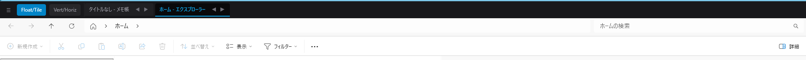
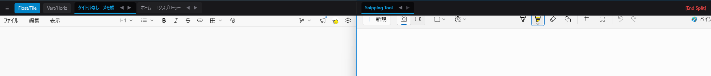

# monaka-wm

> **🇯🇵 日本語** | [🇬🇧 English](#english)

---

## 🇯🇵 日本語

**monaka-wm** は、Windows向けのタブ（スタック）管理とタイル型画面分割を融合したウィンドウマネージャーアプリケーションです。マルチモニター環境にも完全対応しています。

### 特徴

- 🗂️ **タブ管理** — 開いているウィンドウをオーバーレイ型タスクバー上のタブで一覧・管理
- 🪟 **タイル型分割** — 最大3カラムのタイルモードでウィンドウを自動配置
- 🖥️ **マルチモニター対応** — 各モニターに独立したタスクバーとレイアウトを提供
- 🔲 **仮想デスクトップ連携** — Windows標準の仮想デスクトップ切り替えを検知し、カラム配置を自動保存・復元
- ⌨️ **グローバルホットキー** — `Win + Shift + ←/→` でアクティブウィンドウをモニター間移動

### 動作環境

| 項目 | 要件 |
|---|---|
| OS | Windows 10 / 11 |
| ランタイム | .NET 10.0 |
| フレームワーク | WPF (Windows Presentation Foundation) |

### インストール / ビルド方法

```bash
# リポジトリをクローン
git clone https://github.com/hamano1204/monaka-wm.git
cd monaka-wm

# ビルド
dotnet build

# 実行
dotnet run
```

### 主な機能

#### 表示モードの切り替え（Float / Tile）
- **Floatモード（デフォルト）**: ウィンドウの位置・サイズは変更せず、タブクリックで対象ウィンドウをアクティブ（最前面）にします。
- **Tileモード**: 画面を最大3カラムに分割し、各カラムのアクティブウィンドウを隙間なくタイル状に配置します。

#### オーバーレイ型タスクバー
各モニターの上部に極細センサーバー（高さ4px）を常駐表示。マウスをホバーすると自動的に展開（高さ45px）してタブや操作パネルを表示します。通常作業中は作業領域を侵食しません。

#### ウィンドウのモニター間移動
| 操作 | 動作 |
|---|---|
| `Win + Shift + ←/→` | アクティブウィンドウを隣のモニターへ移動 |
| タブの ◀ / ▶ をダブルクリック | そのウィンドウを隣のモニターへ移動 |
| タブを右クリック | コンテキストメニューから移動先モニターを選択 |

#### 空カラムの自動スライド
カラムが空になると右側のカラムが自動的に左へスライドし、レイアウトの隙間を詰めます。

### アーキテクチャ

MVVMパターンに基づいて構成されています。

```
MainWindow (WPF UI)
  └── MainViewModel (ViewModel)
        └── WindowManager (コアロジック / シングルトン)
              ├── LayoutEngine       (タイルレイアウト計算)
              ├── VirtualDesktopService (仮想デスクトップ連携)
              └── WindowHookService  (WinEventHookによるOSイベント監視)
```

### ライセンス

[LICENSE](./LICENSE) ファイルを参照してください。

### 注意事項
- 本アプリはAIで作成されたアプリです。
- そのため、コードの品質には注意が必要です。
- 危険なコードは含まれていないはずですが、自己責任でご利用ください。

---

<a name="english"></a>

## 🇬🇧 English

**monaka-wm** is a Windows window manager that combines tab (stack) management with tiling window layout. It fully supports multi-monitor environments.

### Features

- 🗂️ **Tab Management** — Browse and manage all open windows as tabs in an overlay taskbar
- 🪟 **Tiling Layout** — Automatically arrange windows in up to 3 columns in Tile mode
- 🖥️ **Multi-Monitor Support** — Each monitor gets its own independent taskbar and layout
- 🔲 **Virtual Desktop Integration** — Detects Windows virtual desktop switches and saves/restores column layouts per desktop
- ⌨️ **Global Hotkeys** — Move the active window between monitors with `Win + Shift + ←/→`

### Requirements

| Item | Requirement |
|---|---|
| OS | Windows 10 / 11 |
| Runtime | .NET 10.0 |
| Framework | WPF (Windows Presentation Foundation) |

### Installation / Build

```bash
# Clone the repository
git clone https://github.com/hamano1204/monaka-wm.git
cd monaka-wm

# Build
dotnet build

# Run
dotnet run
```

### Key Features

#### Display Mode (Float / Tile)
- **Float mode (default)**: Does not resize or reposition windows. Clicking a tab simply activates (brings to front) the corresponding window.
- **Tile mode**: Splits the screen into up to 3 columns and arranges the active window in each column seamlessly.

#### Overlay Taskbar
A slim sensor bar (4px tall) is always displayed at the top of each monitor. When you hover the mouse over it, it automatically expands to 45px to reveal tabs and controls. It doesn't intrude on your workspace during normal use.

#### Moving Windows Between Monitors
| Action | Behavior |
|---|---|
| `Win + Shift + ←/→` | Move active window to the adjacent monitor |
| Double-click ◀ / ▶ on a tab | Move that window to the adjacent monitor |
| Right-click a tab | Select destination monitor from context menu |

#### Automatic Column Sliding
When a column becomes empty, the columns to its right automatically slide left to close the gap.

### Architecture

Built on the MVVM pattern.

```
MainWindow (WPF UI)
  └── MainViewModel (ViewModel)
        └── WindowManager (Core logic / Singleton)
              ├── LayoutEngine          (Tile layout calculation)
              ├── VirtualDesktopService (Virtual desktop integration)
              └── WindowHookService     (OS event monitoring via WinEventHook)
```

### Win32 & COM APIs Used

- **user32.dll**: `EnumWindows`, `SetWindowPos`, `SetWindowPlacement`, `SetWinEventHook`, `RegisterHotKey`, etc.
- **shell32.dll**: `SHAppBarMessage` (AppBar registration)
- **dwmapi.dll**: `DwmGetWindowAttribute` (Cloak state detection)
- **IVirtualDesktopManager (COM)**: Virtual desktop management

### License

See the [LICENSE](./LICENSE) file for details.

### Notes
- This application was developed using AI.
- Please be aware that code quality may require attention.
- While it should not contain any malicious code, please use it at your own risk.

### Screenshot




