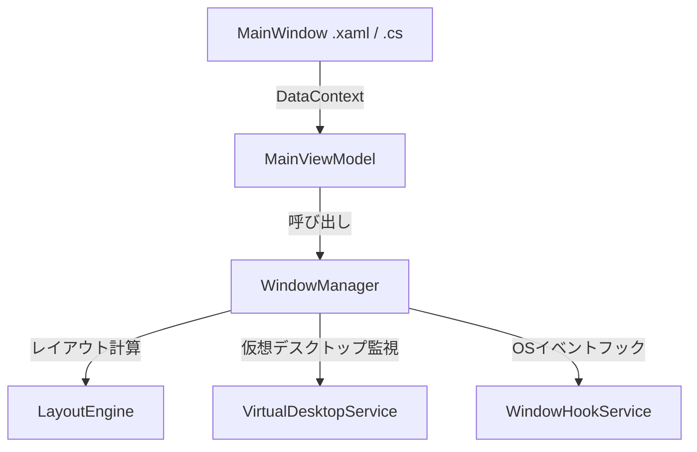

# monaka-wm 設計書 (Architecture & Design Specification)

`monaka-wm` は、WindowsOS向けのタブ（スタック）管理とタイル型画面分割を融合したウィンドウマネージャーアプリケーションです。マルチモニター環境にも完全対応しています。

---

## 1. 概要 (Overview)
本アプリケーションは、マルチタスク作業における「何のウィンドウを開いているか分からなくなる」「仕事の割り込みで配置が崩れる」といった課題を解決するため、画面上部へのタスクバーの常駐、各ウィンドウのスタック管理、および画面分割（タイルモード）機能を提供します。

---

## 2. コア機能 (Core Features)
* **表示モードの切替 (Float/Tile Mode)**
  * **Float（フロート）モード (デフォルト)**: ウィンドウの位置やサイズ変更は行わず、タスクバー上のタブをクリックした際に該当ウィンドウをアクティブ（最前面）にするのみの動作。
  * **Tile（タイル）モード**: 画面分割を有効化し、各カラムのアクティブウィンドウをタイル状にリサイズして隙間なく配置します。
* **画面分割管理 (Tiling & Sliding Columns)**
  * 最大3カラム（横3列）までの画面分割をサポートします。
  * タブ内の矢印ボタン（◀ / ▶）をシングルクリックすることで、ウィンドウを隣のカラムに移動できます。
  * カラムが空になった場合は、自動的に右側のカラムが左側にスライドし、カラムの隙間（中抜き）を詰める整列機能（中抜き防止ロジック）を搭載しています。
* **仮想デスクトップ連携 (Virtual Desktop Integration)**
  * Windows標準の仮想デスクトップ切り替えを検知し、デスクトップごと、およびモニターごとに「カラム数」「アクティブウィンドウ」「ウィンドウごとのカラム配置」を保存・復元します。
* **マウスホバー伸縮によるオーバーレイ型タスクバー (Overlay Bar)**
  * アプリ起動時、各画面（モニター）の上部に幅いっぱいのタスクバー（通常時は高さ4pxの極細センサーバー）を最前面表示します。マウスがこの領域にホバーすると自動的に高さ45pxに拡張され、操作パネルやタブが表示されます。
* **マルチモニター対応 (Multi-Monitor Support - 独立タイルモデル)**
  * 接続されているすべてのモニターに対し個別の `MainWindow` インスタンスを起動・配置し、モニターごとに独立したタイルレイアウト構造を管理します。
* **モニター間のウィンドウ移動 (Window Transfer)**
  * **ホットキーによる移動**: `Win + Shift + Left` または `Win + Shift + Right` を押下することで、現在アクティブなフォアグラウンドウィンドウを隣のモニターへ転送します。
  * **ダブルクリックによる移動**: タブの列移動ボタン（◀ / ▶）をダブルクリックすることで、そのウィンドウを隣のモニターへ転送します（シングルクリックとダブルクリックを遅延タイマーで自動判定）。
  * **右クリックコンテキストメニュー**: 各タブを右クリックすると接続されているモニター一覧のダークテーマメニューが表示され、選択したモニターへウィンドウを直接移動できます。

---

## 3. システム構成・アーキテクチャ (System Architecture)

アプリケーションはMVVMパターンに基づき、以下のコンポーネントで構成されています。

### 3.1. 主要コンポーネントの説明

| コンポーネント名 | 役割・概要 |
| :--- | :--- |
| **MainWindow** | 各モニターに個別に描画され、オーバーレイ型タスクバーUIと対応カラムのリストボックスを表示します。 |
| **MainViewModel** | UIとビジネスロジックの中継を行い、各カラムのウィンドウリスト（CollectionView）やUI用コマンドを公開します。 |
| **WindowManager** | 本アプリのコア管理者（シングルトン）。複数モニター状態（`MonitorState`）の集約、OSイベントフックからのコールバック処理、仮想デスクトップ切り替え時の状態保存・復元、グローバルホットキーの管理を担当します。 |
| **LayoutEngine** | 各モニターの作業可能領域（`Screen.WorkingArea`）とDPI解像度に基づき、タイルモードにおけるウィンドウ位置・サイズを計算して `SetWindowPos` 等で配置します。 |
| **VirtualDesktopService** | COMインターフェース（`IVirtualDesktopManager`）を利用し、ウィンドウが属する仮想デスクトップの特定やデスクトップ状態の保持を行います。 |
| **WindowHookService** | WinEventHookを使用し、ウィンドウの生成、破棄、最小化、アクティブ化、クローク（非表示化）などのOSイベントをリアルタイムに監視します。 |

---

## 4. 詳細設計・処理ロジック (Detailed Specifications)

### 4.1. ウィンドウの管理対象判定 (ShouldManageWindow)
本アプリで管理（タブ化・タイル配置）する対象ウィンドウは、以下のWin32属性およびクラス名フィルターをすべて満たすものに制限されます。

1. **基本条件**:
   * 表示状態であること（`IsWindowVisible`）
   * 子ウィンドウでないこと（`WS_CHILD` スタイルを持たない）
   * ツールウィンドウでないこと（`WS_EX_TOOLWINDOW` スタイルを持たない）
   * オーナーウィンドウを持たない、あるいは持っている場合は `WS_EX_APPWINDOW` スタイルを持つこと
2. **システム・シェルウィンドウの除外**:
   * クラス名が以下と一致するものを除外: `Progman`, `WorkerW`, `Shell_TrayWnd`, `Shell_SecondaryTrayWnd`
   * タイトルが空のもの、または「Windows 入力エクスペリエンス」などのシステム背景ウィンドウを除外
3. **通知・ポップアップの除外**:
   * クラス名が以下と一致・含むものを除外: `tooltips_class32`, `tooltip`（部分一致）, `XamlBalloon`
4. **右クリックメニュー・ジャンプリストの除外**:
   * コンテキストメニュー（クラス名: `#32768`）の除外
   * タスクバー右クリック時のジャンプリスト等（クラス名: `Windows.UI.Core.CoreWindow`、またはタイトルに `ジャンプ リスト` / `Jump List` を含むもの）の除外

### 4.2. 空カラムの自動スライド処理 (Column Sliding Logic)
タイルモードにおいて、カラムとウィンドウの配置ズレを防止するため、空のカラムが生じた場合は即座に右詰めで整列します。
* **処理タイミング**: ウィンドウの移動、ウィンドウの消滅、デスクトップ切り替え時など、`UpdateActiveWindows()` が呼び出された際。
* **処理の流れ**:
  1. モニターごとに管理されるカラム0から順にループし、現在のカラム `i` が空かつ `i+1` 以降にウィンドウが存在するか判定。
  2. 条件を満たした場合、`i+1` 以降のすべてのウィンドウの `ColumnIndex` を左シフト（デクリメント）。
  3. シフトが発生しなくなるまで繰り返し実行。
  4. 最終的にアクティブな最大インデックスに基づいて各モニター状態の `ColumnsCount` を更新。

### 4.3. 仮想デスクトップ切り替えとクローク処理 (Virtual Desktop & Cloak Handling)
* **イベントの区別**:
  Windowsの仮想デスクトップ切り替え時、非アクティブになったデスクトップのウィンドウはOSにより「クローク（Cloak）」状態になります。
  * **アプリの最小化や一時的なクローク**: `IsWindowOnCurrentDesktop(hWnd)` が `true` のままクロークされた場合は、アプリが最小化や非アクティブ化されたとみなし、管理リスト（`Windows`）から削除します。
  * **デスクトップ切り替えによるクローク**: `IsWindowOnCurrentDesktop(hWnd)` が `false` になったクロークイベント（別デスクトップへの移行）時は、管理リストから削除せず状態（`ColumnIndex`）を保持します。これにより、元のデスクトップに戻った際に以前のカラム位置が完全に復元されます。

### 4.4. ウィンドウ初期配置のキャプチャタイミングとサイズ維持
タイルモードにおいて、非アクティブなウィンドウを一時的に画面外（オフスクリーン座標: -32000, -32000）へ移動して非表示化します。この際、元の配置とサイズを正しく保存・復元するために以下の設計を採用しています。
* **即時キャプチャ**: ウィンドウが管理対象に追加された直後（`AddWindow` 内）、レイアウト処理（`ApplyLayout`）によって画面外に移動される前に、現在のウィンドウ位置を `WINDOWPLACEMENT` としてキャプチャします。
* **サイズ維持の非表示化**: ウィンドウを画面外に退避させる際、`SetWindowPos` に `SWP_NOSIZE` フラグを適用します。サイズを変更せずに座標のみを移動させることで、OSやアプリケーションが元のウィンドウサイズを極小サイズで上書きしてしまうバグを防止します。

### 4.5. アプリ終了時の確実な復元とシャットダウンフロー
* **シャットダウン順序の保証**: `MainWindow` の閉じる処理において、WPF の `Window_Closed` イベント発生時に必ず `WindowManager.Instance.Shutdown()` を実行します。また、クリーンアップ処理は `try-catch` で保護し、個別のエラーが全体の復元処理を阻害しないようにします。
* **復元ロジックの改善 (ShowWindow + SetWindowPos)**: クロスプロセスウィンドウや UWP アプリ（`ApplicationFrameWindow`）に対する `SetWindowPlacement` の制限（画面外にある場合に復元が失敗することがある現象）を回避するため、最小化解除（`ShowWindow(SW_RESTORE)`）と `SetWindowPos`（明示的な座標再配置および `SWP_SHOWWINDOW`）を組み合わせた2フェーズの復元処理を実行します。

### 4.6. マルチモニターにおけるタスクバーの動的配置と伸縮制御
複数の `MainWindow` が起動されるため、それぞれのインスタンスが属するモニター領域（`Screen`）の境界を正確に追跡します。
* **動的配置**: 起動時、対応するモニター（`_targetScreen`）の絶対座標に基づいてタスクバーウィンドウを各ディスプレイの最上部に配置します。
* **ホバーによる伸縮制御**: マウスカーソルのホバー状態（`MouseEnter` / `MouseLeave`）を検知し、タイマー処理を介して最前面ウィンドウの `Height` を 4px (センサーバー状態) と 45px (操作パネル状態) で相互に伸縮させます。これにより、通常の作業領域を侵食せずに操作時にのみタスクバーへアクセスできます。

### 4.7. 例外処理とクラッシュ防止対策 (Robust Exception Handling)
仮想デスクトップ切り替え時や過渡的なフォーカス変更時など、一時的に OS 上に無効なウィンドウハンドルが飛び交う状況下でもメインスレッドを死守するため、全系統の Win32/COM 処理に保護回路を施しています。
* **保護箇所**: `SwitchToDesktop`, `WinEventCallback`, `HandleForegroundEvent`, `HandleWindowEvent` およびすべての `OnWindow...` で始まる個別イベントハンドラを `try-catch` で防護。
* **モニター検出の保護**: ウィンドウのモニター解決関数 `Screen.FromHandle(hWnd)` が transient なハンドルにより失敗した場合に例外をスローせず、プライマリモニターへ安全にフォールバックさせます。
* **終了の同期化**: Windowsタスクバーからいずれかのモニターのタスクバーウィンドウが閉じられた場合、[App.xaml.cs](file:///c:/Users/haman_9/dev/monaka-wm/App.xaml.cs) 内でこれを検知し、全モニターウィンドウのクローズ処理とアプリ全体のシャットダウン（`Application.Current.Shutdown()`）をスレッドセーフに連動させてプロセスの残存を完全に防止します。

---

## 5. 使用API一覧 (Win32 & COM Interop)
* **user32.dll**:
  * `EnumWindows`, `IsWindowVisible`, `SetWindowPos`, `SetWindowPlacement`, `GetWindowPlacement`
  * `SetWinEventHook`, `UnhookWinEvent` (OSイベント監視用)
  * `GetAncestor` (UWP CoreWindowのルート解決用)
  * `RegisterHotKey`, `UnregisterHotKey` (ショートカットキー制御用)
* **shell32.dll**:
  * `SHAppBarMessage` (AppBar登録用)
* **dwmapi.dll**:
  * `DwmGetWindowAttribute` (クローク状態判定用: `DWMWA_CLOAKED`)
* **IVirtualDesktopManager (COM)**:
  * `IsWindowOnCurrentVirtualDesktop`, `GetWindowDesktopId`, `MoveWindowToDesktop`
